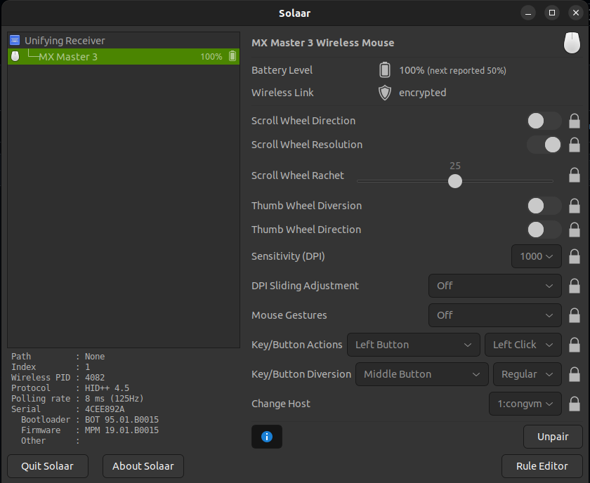

# Devices


# MX Master 3 or Any Logitech Mouse

## Connect via Dongle

Solaar Driver: https://github.com/pwr-Solaar/Solaar/tree/master

```bash
sudo apt install solaar # Ubuntu

# Solaar requires root access
sudo groupadd solaar
sudo usermod -aG solaar $USER

# Rules for udev
## Download the rules from https://github.com/pwr-Solaar/Solaar/blob/master/rules.d/42-logitech-unify-permissions.rules
sudo cp 40-logitech-unify-permissions.rules /etc/udev/rules.d/
sudo udevadm control --reload-rules

# No need to restart, just unplug and plug the dongle
```
### References
- [1] https://pwr-solaar.github.io/Solaar/rules 
- [2] https://askubuntu.com/questions/1200543/19-10-solaar-not-seeing-logitech-unifying-receiver 
- [3] https://pwr-solaar.github.io/Solaar/installation
- [4] https://github.com/pwr-Solaar/Solaar/blob/master/rules.d/42-logitech-unify-permissions.rules
- [5] https://www.reddit.com/r/Ubuntu/comments/smx5lq/found_a_logitech_receiver_devhidraw1_but_did_not/

  


## Connect via Bluetooth

It is OK to connect via Bluetooth, but the connection is not stable. It is recommended to use the dongle.


### Known Issues

Mouse is disconnecting and reconnecting every minute or so:
  - Check this [link](https://askubuntu.com/questions/1435112/ubuntu-20-04-bluetooth-mouse-is-disconnecting-and-reconnecting-every-minute-or) for a possible solution.